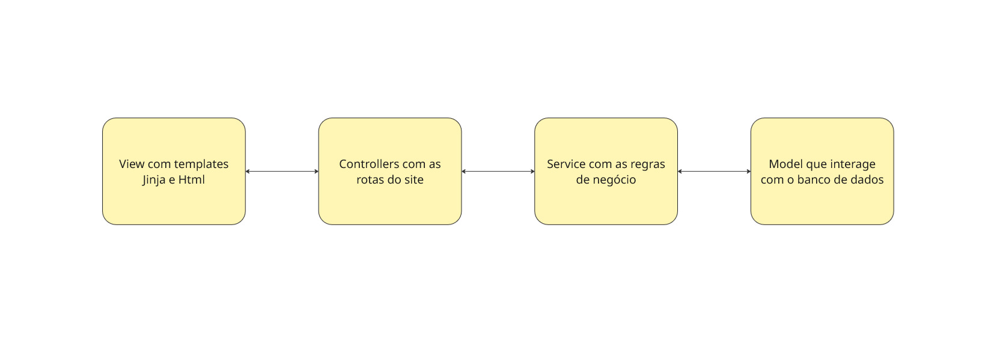
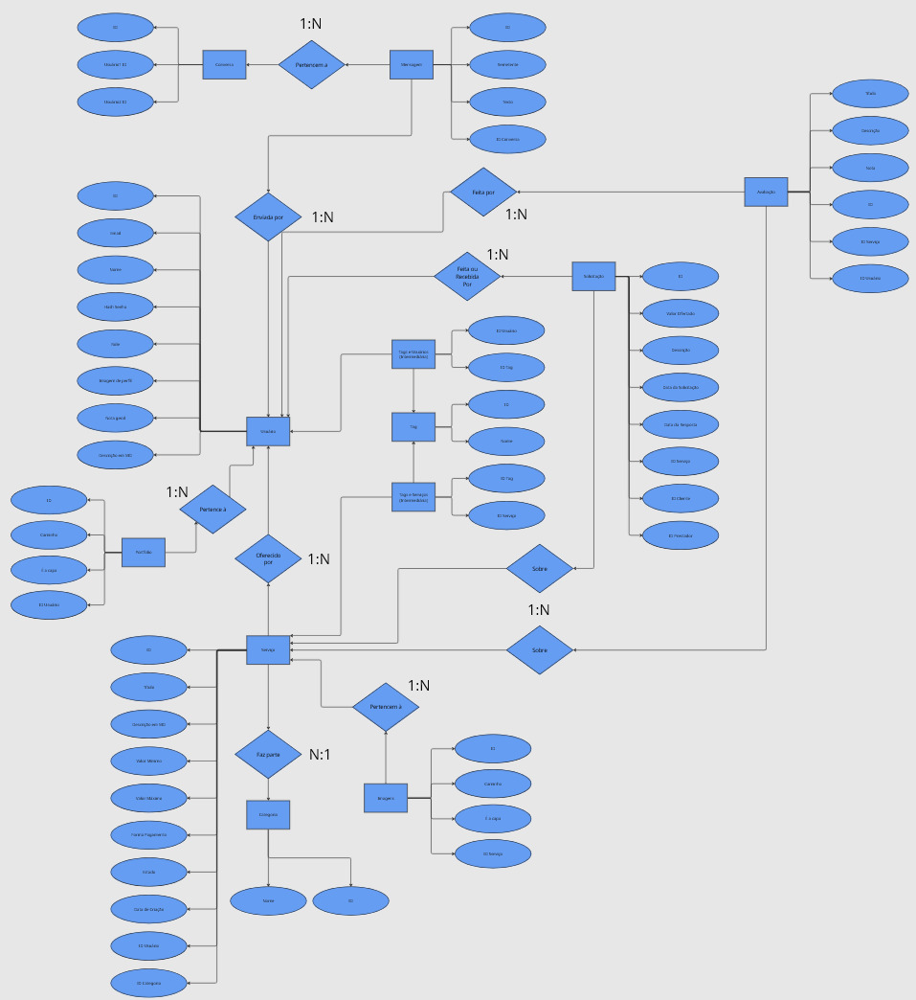

# UniTasker 🎓

> 🚀 Plataforma web de freelancing e voluntariado criada para conectar estudantes universitários. Um ecossistema pensado para ganhar experiência real, construir portfólio e colaborar em projetos.

## 📋 Tabela de Conteúdos
1. [Sobre o Projeto](#-sobre-o-projeto)
2. [Features](#-features)
3. [Arquitetura e Tecnologias](#-arquitetura-e-tecnologias)
4. [Estrutura de Dados](#-estrutura-de-dados)
5. [Instalação e Execução](#-instalação-e-execução)
6. [Autores](#-autores)

---

## 📜 Sobre o Projeto

O **UniTasker** nasceu da observação de que, dentro do ambiente universitário, existe um vasto potencial de colaboração inexplorado. O projeto visa resolver a dificuldade de conexão entre alunos de diferentes cursos, criando um marketplace de serviços onde estudantes podem:

* **Solicitar serviços** (ex: formatação ABNT, aulas de reforço, design de logo).
* **Oferecer suas habilidades**, ganhando experiência prática e construindo um portfólio real.
* **Promover o networking** e a troca de conhecimentos de forma simples e segura.

O foco do projeto vai além da funcionalidade: ele atua como uma ferramenta para a **coleta e análise de dados** sobre as dinâmicas de colaboração na comunidade acadêmica.

---

## ✨ Features

- **👤 Conta Unificada:** Um único perfil permite atuar como Cliente e Prestador simultaneamente.
- **🎨 Portfólio Visual:** Galeria de imagens para exibir seus trabalhos.
- **🤝 Sistema de Propostas:** Fluxo de negociação completo (Solicitação -> Aceite/Recusa -> Conclusão), permitindo negociação de valor.
- **💬 Chat Entre Usuários:** Os usuários podem conversar e negociar em tempo real por meio de um chat baseado em WebSockets.
- **🔐 Segurança Avançada:**
    - Autenticação via Flask-Login.
    - Proteção de senhas com **Bcrypt**.
    - Controle de acesso baseado em papéis (RBAC) para áreas administrativas.
- **📢 Gestão de Serviços:** Criação de anúncios com tags, categorias, imagens de capa e precificação flexível (Fixo, Faixa de Preço ou Voluntário).
- **⭐ Reputação:** Sistema de avaliação com cálculo automático de nota média.
- **☁️ Infraestrutura Moderna:** Uploads seguros com limpeza automática e persistência em volumes Docker.

---

## 🏛️ Arquitetura e Tecnologias

A aplicação foi desenvolvida seguindo uma **Arquitetura de Quatro Camadas** para garantir desacoplamento e testabilidade.

| Camada | Tecnologia | Responsabilidade |
| :--- | :--- | :--- |
| **View** | HTML, CSS, Jinja2 | Interface do usuário e renderização no servidor (SSR). |
| **Controller** | Flask (Blueprints) | Roteamento, validação de entrada e orquestração HTTP. |
| **Service** | Python | Lógica de negócio pura, regras de validação e processamento de dados. |
| **Model** | SQLAlchemy (ORM) | Definição de esquemas e interação com o banco de dados. |



### Infraestrutura (DevOps)

O projeto é totalmente containerizado para garantir paridade entre ambientes de desenvolvimento e produção.

* **Docker Compose:** Orquestra os serviços.
* **Gunicorn:** Servidor de aplicação WSGI para produção.
* **Caddy:** Servidor web que atua como Proxy Reverso e gerencia automaticamente certificados **HTTPS/SSL**.
* **PostgreSQL:** Banco de dados relacional robusto com persistência de dados via volumes.

---

## 📊 Estrutura de Dados

A modelagem de dados foi planejada para garantir **integridade**, **escalabilidade** e **alta performance**:

- **Soft Delete:** Usuários e serviços não são removidos fisicamente, preservando histórico e permitindo auditoria.
- **Polimorfismo de Tags:** A entidade `Tag` é reutilizada para classificar tanto serviços quanto habilidades dos usuários, reduzindo redundância.
- **Normalização:** Entidades como `Usuário`, `Serviço`, `Solicitação` e `Avaliação` possuem responsabilidades bem definidas, evitando inconsistências e facilitando manutenção.



---

## 🏁 Instalação e Execução (Local)

Siga estas instruções para rodar o projeto na sua máquina.

### Pré-requisitos

* Docker e Docker Compose instalados.

### Passo a Passo

1. **Clone o repositório:**
    ```bash
    git clone [https://github.com/JoaoFazolim/UniTasker.git](https://github.com/JoaoFazolim/UniTasker.git)
    cd unitasker
    ```

2. **Configure as variáveis de ambiente:**
    Crie um arquivo `.env` na raiz baseado no exemplo:
    ```env
    DB_USER=postgres
    DB_PASSWORD=sua_senha
    DB_NAME=unitasker
    SECRET_KEY=chave_super_secreta
    ```

3. **Suba os containers:**
    ```bash
    docker-compose up --build
    ```
    *O banco de dados será populado com alguns exemplos automaticamente pelo script `seed.py` na primeira execução.*

4. **Acesse:**
    Abra o navegador em `http://localhost:8080` (ou a porta configurada no Caddy).

---

## 👥 Equipe

* **Amanda Pires de Oliveira** - *Frontend e Prototipagem*
* **Ana Clara Inácio** - *Análise de Dados e Frontend*
* **João Fernando Fazolim Calixto** - *Backend, Arquitetura e DevOps*

